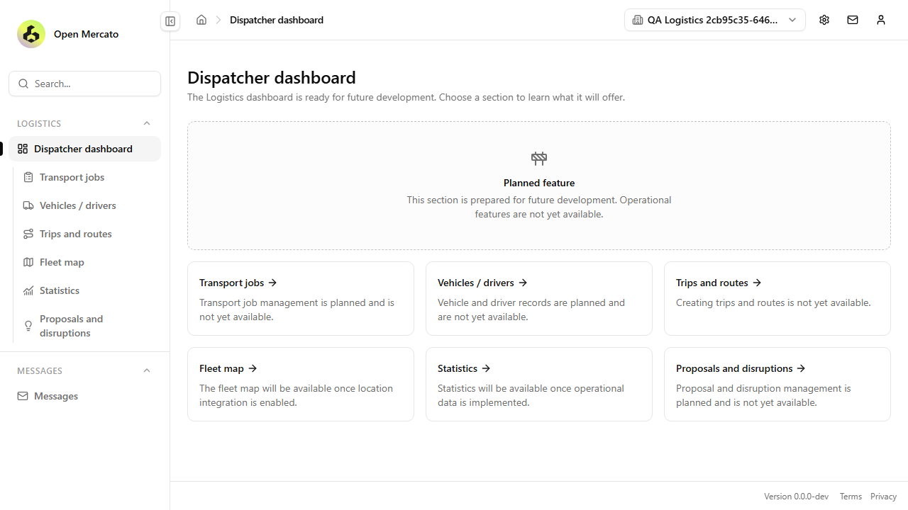
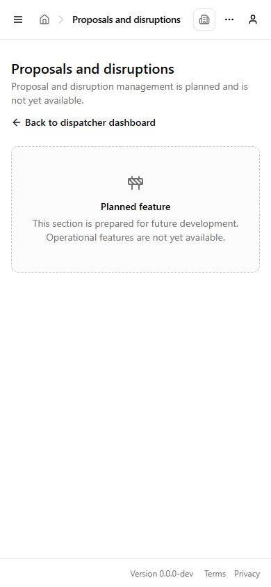
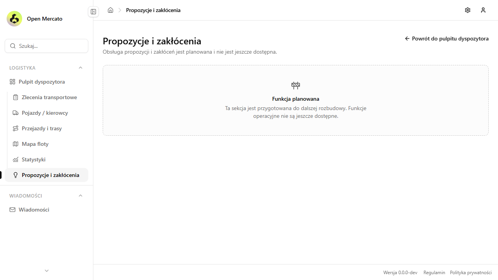
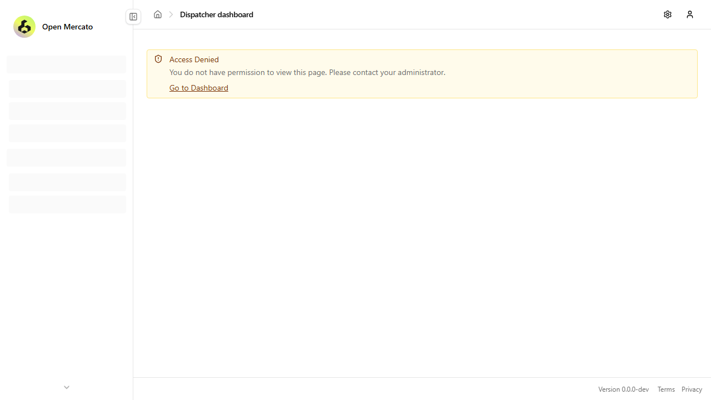

# Logistics foundation verification

Verified on 19 September 2026 against implementation commit `c6421b465e1453b6583246fa9e1d4ecd09df6c3b`. The imported Open Logistic implementation has the same application source; repository identity, specification and evidence documentation were added afterward.

## Results

- **48 unit tests passed**, including page metadata, default administrator access, five locales and planned-state content. An independent reviewer reproduced this run.
- **24 browser integration tests passed** in 59.1 seconds, with no failures, skipped tests or flaky results. The managed disposable environment run covered all seven routes, reloads and menu links; dashboard navigation; denial without grants; both wildcard forms; grant revocation; organization switching and spoofed selections; mobile keyboard navigation; session removal; Polish translations; and existing Customers navigation.
- **Template parity and scoped design-system lint passed.** The independent review's missing template and integration-source findings were resolved in the imported implementation.
- The implementation run completed both package builds, generation, translation synchronization/usage checks, full typechecking and the production application build. Generation used the existing static OpenAPI fallback after a JSON import-attribute warning.
- **The full monorepo test gate is not green on the original Windows worktree.** Existing create-app tests encounter Windows path/shell assumptions, and some Jest root patterns under `.ai` match no tests. These results are not represented as a complete full-suite pass; the explicit logistics unit and browser runs above did execute their tests.

The initial managed environment failed startup. A later run with an isolated runtime secret started successfully and completed all 24 scenarios. Local environment values and credentials are not included here.

## Screenshot evidence

These screenshots come from the successful browser integration run with isolated QA fixtures. They were visually inspected for layout and translated/planned-state content. A separate manual browser check also confirmed administrator login and the dispatcher dashboard; it is not a replacement for the integration coverage.

### Dispatcher dashboard

### Mobile section

### Polish translation

### Access control

This is evidence of the initial static navigation foundation. Operational transport management, records, maps and analytics remain planned, as specified.
